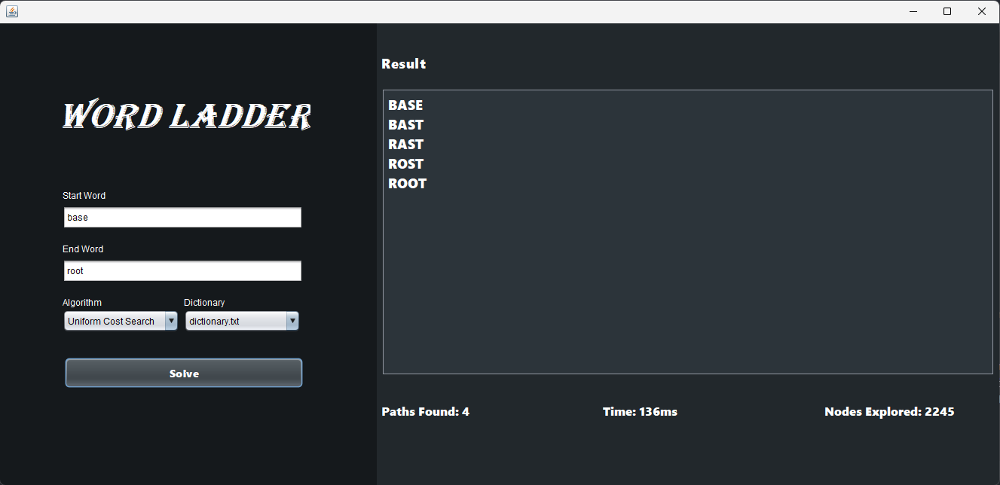

# Tugas Kecil III Strategi Algoritma (IF2211)
## Oleh :
- Ahmad Mudabbir Arif  (13522072)


## Table of Contents
* [Tentang Program](#word)
* [Screenshots](#screenshots)
* [Dependencies](#dependencies)
* [How to Use](#how-to-use)


## Word Ladder <a href="word"></a>
>  Word ladder (juga dikenal sebagai Doublets, word-links, change-the-word puzzles, paragrams, laddergrams, atau word golf) adalah salah satu permainan kata yang terkenal bagi seluruh kalangan.

Program ini adalah program yang digunakan untuk menemukan jalur kata dari kata awal ke kata akhir dengan menggunakan algoritma _UCS_, _Greedy Best First Search_, dan _A*_. Program ini akan meminta input berupa kata awal dan kata akhir yang memiliki panjang yang sama. Kemudian, program akan menampilkan jalur kata dari kata awal ke kata akhir beserta jumlah langkah yang ditempuh. Program ini juga akan menampilkan waktu yang dibutuhkan untuk menemukan jalur kata tersebut. Program ini juga akan menampilkan jumlah node yang dieksplorasi untuk menemukan jalur kata tersebut.


## Screenshots <a href="screenshots"></a>


## Dependencies <a href="dependencies"></a>
Windows:
- java 22.0.1 2024-04-16
- Java(TM) SE Runtime Environment (build 22.0.1+8-16)
- Java HotSpot(TM) 64-Bit Server VM (build 22.0.1+8-16, mixed mode, sharing)

Linux:
- openjdk 19.0.2 2023-01-17
- OpenJDK Runtime Environment (build 19.0.2+7-Ubuntu-0ubuntu322.04)
- OpenJDK 64-Bit Server VM (build 19.0.2+7-Ubuntu-0ubuntu322.04, mixed mode, sharing)

## How to Use <a href="how-to-use"></a>
1. Clone repository ini dengan 
    ```
    git clone https://github.com/Dabbir/Tucil3_13522072.git
    ```
2. Buka file directory/location tempat repository berada, buka terminal di root folder dan jalankan melalui 2 cara
    - CLI
    ```
    ./run.bat
    ```
    - GUI
    ```
    ./app.bat
    ```
3. Pada program, lakukan langkah sebagai berikut:
    
    CLI:
    - Masukkan `dictionary` yang akan digunakan (e.g. dictionary.txt)
    - Masukkan `Start Word` dan `End Word` pada form input
    - Pilih Algortima yang akan digunakan, `UCS`, `Greedy Best-First Search`, atau `A*`

    GUI:
    - Masukkan `Start Word` dan `End Word` pada form input
    - Pilih Algortima yang akan digunakan, `UCS`, `Greedy Best-First Search`, atau `A*`
    - Pilih dictionary yang akan digunakan, 
        `dictonary.txt` adalah dictionary testing,
        `dictonary2.txt` adalah dictionary oracle dari QNA
    - Klik `Solve` untuk menghasilkan path
4. Jika ingin melakukan generate ulang, ulangi langkah 3
5. Close program untuk mengakhiri

Jika pada linux tidak dapat dijalankan, lakukan compile ulang dengan:
```
javac -d bin src/algorithms/Algorithm.java src/algorithms/UCS.java src/algorithms/GreedyBFS.java src/algorithms/AStar.java src/dictionary/Dictionary.java src/interfaces/FunctionValue.java src/interfaces/GValue.java src/interfaces/HValue.java  src/nodes/Nodes.java src/Driver.java src/Main.java src/WordLadderApp.java src/error/Error.java
```

Lalu run lagi dengan:
```
java -cp bin Main
```